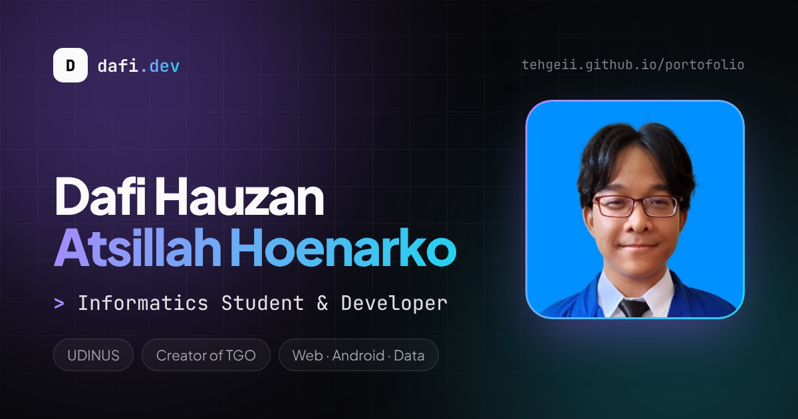

# dafi.dev · Portofolio

Website portofolio pribadi **Dafi Hauzan Atsillah Hoenarko** ([@tehgeii](https://github.com/tehgeii)), mahasiswa Teknik Informatika Universitas Dian Nuswantoro (UDINUS) dan kreator **TGO (Tech Gameplay Optimizer)**.

🌐 **Live:** <https://tehgeii.github.io/portofolio/>



## ✨ Fitur

| Fitur                     | Keterangan                                                                                                    |
| ------------------------- | ------------------------------------------------------------------------------------------------------------- |
| 🌗 **Dark / Light mode**  | Mengikuti pengaturan perangkat, bisa diganti manual dengan animasi _circular reveal_, pilihan tersimpan.      |
| 🇮🇩🇬🇧 **Dua bahasa**       | Bahasa Indonesia & English, terdeteksi otomatis dari browser dan bisa diganti kapan saja.                     |
| ⌘ **Command palette**     | Tekan `Ctrl + K` / `⌘ + K` atau `/` untuk lompat ke section, membuka project, ganti tema/bahasa, salin email. |
| 🧭 **Navigasi pintar**    | Navbar dengan _scroll-spy_, progress bar baca, tombol kembali ke atas, menu mobile layar penuh.               |
| 🗂️ **Project interaktif** | Filter kategori beranimasi, modal detail (Esc untuk tutup, ← → untuk pindah project).                         |
| 🧠 **Skill kontekstual**  | Arahkan/tap sebuah skill untuk melihat di mana skill itu dipakai.                                             |
| 📈 **GitHub live**        | Statistik repositori, bintang, bahasa, dan repo terbaru diambil langsung dari GitHub API (dengan fallback).   |
| ✉️ **Kontak**             | Salin email sekali klik dan form tervalidasi yang membuka aplikasi email.                                     |
| ♿ **Aksesibel**          | Skip link, fokus keyboard jelas, focus trap di dialog, label ARIA, dan menghormati _reduced motion_.          |
| ⚡ **Ringan & cepat**     | Font di-host sendiri, tanpa backend, siap di-deploy sebagai situs statis.                                     |

## 🛠️ Teknologi

[React 19](https://react.dev) · [TypeScript](https://www.typescriptlang.org) · [Vite](https://vite.dev) · [Tailwind CSS v4](https://tailwindcss.com) · [Motion](https://motion.dev) · [Lucide](https://lucide.dev) · Plus Jakarta Sans & JetBrains Mono

## 🚀 Menjalankan di komputer

Butuh **Node.js 20+**.

```bash
npm install       # pasang dependency
npm run dev       # buka http://localhost:5173
npm run build     # build produksi ke folder dist/
npm run preview   # coba hasil build
npm run lint      # cek kualitas kode
npm run format    # rapikan format kode
```

## ✏️ Mengubah konten

Semua isi website ada di folder [`src/data`](src/data), jadi tidak perlu menyentuh komponen:

| File                                          | Isi                                                   |
| --------------------------------------------- | ----------------------------------------------------- |
| [`profile.ts`](src/data/profile.ts)           | Nama, foto, bio, lokasi, email, dan link sosial media |
| [`projects.ts`](src/data/projects.ts)         | Daftar project, deskripsi, fitur, teknologi, dan link |
| [`skills.ts`](src/data/skills.ts)             | Kategori skill beserta keterangan penggunaannya       |
| [`journey.ts`](src/data/journey.ts)           | Timeline perjalanan kuliah & project                  |
| [`translations.ts`](src/i18n/translations.ts) | Semua teks antarmuka dalam Bahasa Indonesia & English |

Setiap teks punya versi `id` dan `en`. TypeScript akan memberi tahu kalau ada terjemahan yang terlewat.

Foto profil ada di [`src/assets/avatar.jpg`](src/assets/avatar.jpg) (rasio 1:1, fokus wajah & dada). Untuk menggantinya, timpa file tersebut dengan foto persegi baru dengan nama yang sama.

## 🌍 Deploy ke GitHub Pages

Workflow [`.github/workflows/deploy.yml`](.github/workflows/deploy.yml) otomatis menjalankan lint, typecheck, dan build di setiap pull request, lalu men-deploy ke GitHub Pages setiap ada push ke `main`.

Aktifkan sekali saja: **Settings → Pages → Build and deployment → Source: GitHub Actions**.

## 📁 Struktur

```
src/
├── components/
│   ├── layout/     Navbar, Footer, CommandPalette, ScrollProgress, BackToTop
│   ├── sections/   Hero, About, Skills, Projects, Journey, GitHubActivity, Contact
│   └── ui/         Komponen kecil yang dipakai ulang (Section, Reveal, SpotlightCard, …)
├── context/        Tema & toast
├── data/           Konten website
├── hooks/          Scroll-spy, typewriter, GitHub stats, focus trap, …
├── i18n/           Bahasa & terjemahan
└── lib/            Helper (format tanggal, clipboard, platform)
```

## 👤 Author & Kontributor

**Dafi Hauzan Atsillah Hoenarko**, pemilik, perancang, dan kontributor utama website ini.

- GitHub: [@tehgeii](https://github.com/tehgeii)
- LinkedIn: [in/dafi-hauzan](https://www.linkedin.com/in/dafi-hauzan)
- Instagram: [@kokohpasarsenen](https://www.instagram.com/kokohpasarsenen)
- YouTube: [Tech Gameplay Indonesia](https://www.youtube.com/@techgameplayindonesia)
- Email: [antsters9@gmail.com](mailto:antsters9@gmail.com)
- Website TGO: [tgopremium.my.id](https://tgopremium.my.id)

Dibantu oleh Claude (Anthropic) dalam penulisan kode.

## 📄 Lisensi

© 2026 Dafi Hauzan Atsillah Hoenarko. Hak cipta dilindungi. Konten (teks, data project, dan identitas pribadi) tidak boleh digunakan ulang tanpa izin.
